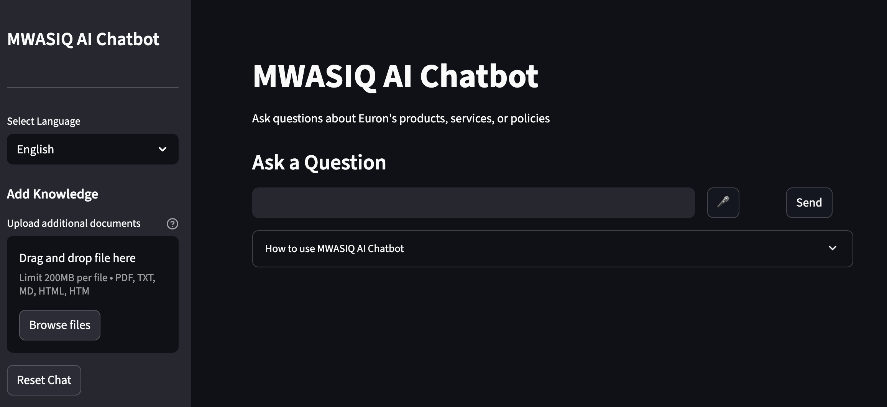

#  MWASIQ AI Chatbot



# VENV
```bash
conda create -n lang6 python=3.11 -y
```

```bash
conda activate lang6
```

```bash
pip install -r requirements.txt
```

### `requirementx.txt`
```bash
langchain==0.3.13
langchain-core==0.3.28
langchain-community==0.3.13
langchain-openai==0.2.14
```

### Running The App
```bash
streamlit run app.py 
```
